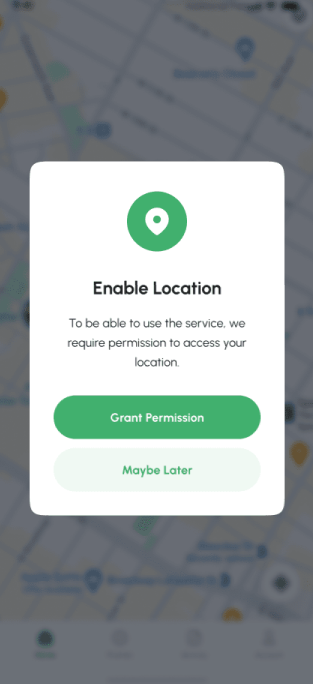
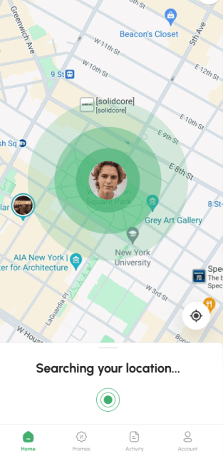
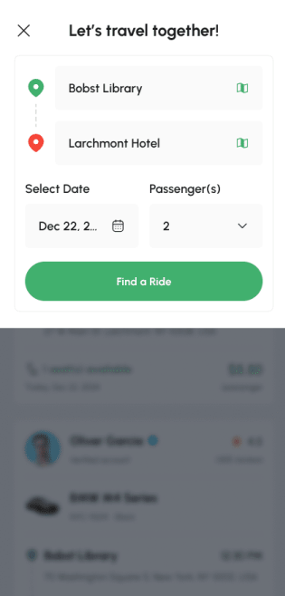
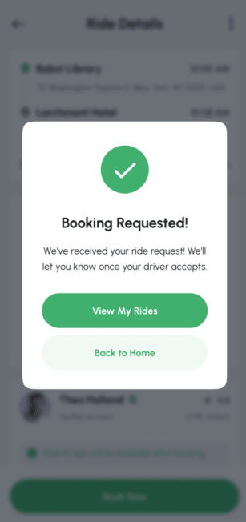
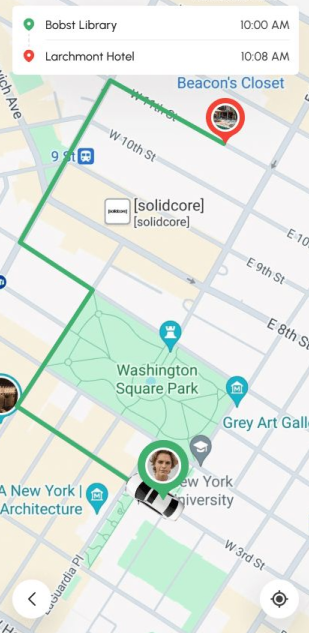
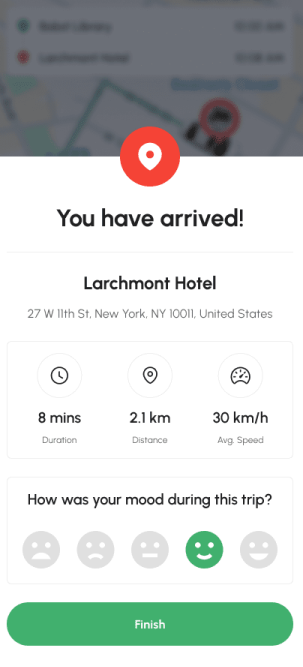

# Ride-Sharing-App

A Kotlin-based Android Ride Sharing Application that allows users to book rides, match with drivers in real-time, and track trips using GPS. The app provides a smooth and user-friendly experience for both passengers and drivers.

---

### Features
* **User Authentication:** Secure Login/Register via Firebase.
* **Ride Booking System:** Seamless flow to request and confirm rides.
* **Real-Time Location Tracking:** Accurate tracking on interactive maps.
* **Smart Matching:** Advanced algorithm to connect riders with the nearest available drivers.
* **Trip Management:** Full lifecycle from Start to End ride.
* **UI/UX:** Clean and responsive UI for a premium user experience.

---

### Tech Stack
* **Language:** Kotlin
* **Framework:** Android SDK
* **Architecture:** MVVM (Clean Architecture)
* **Database:** Firebase
* **Maps:** Google Maps API

---

### App Screenshots

  
  
  

  
  
  

